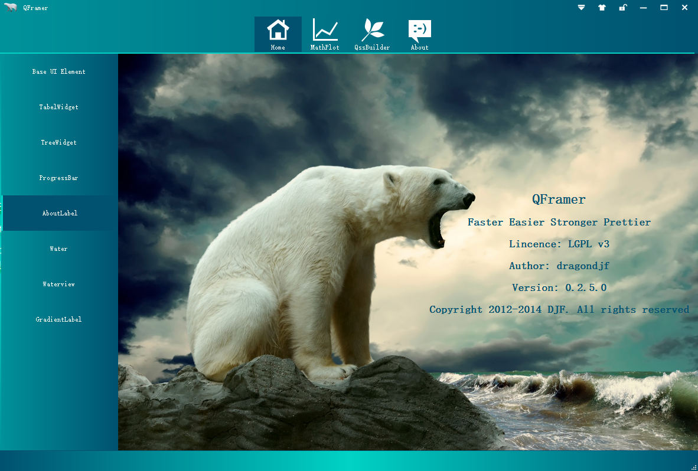
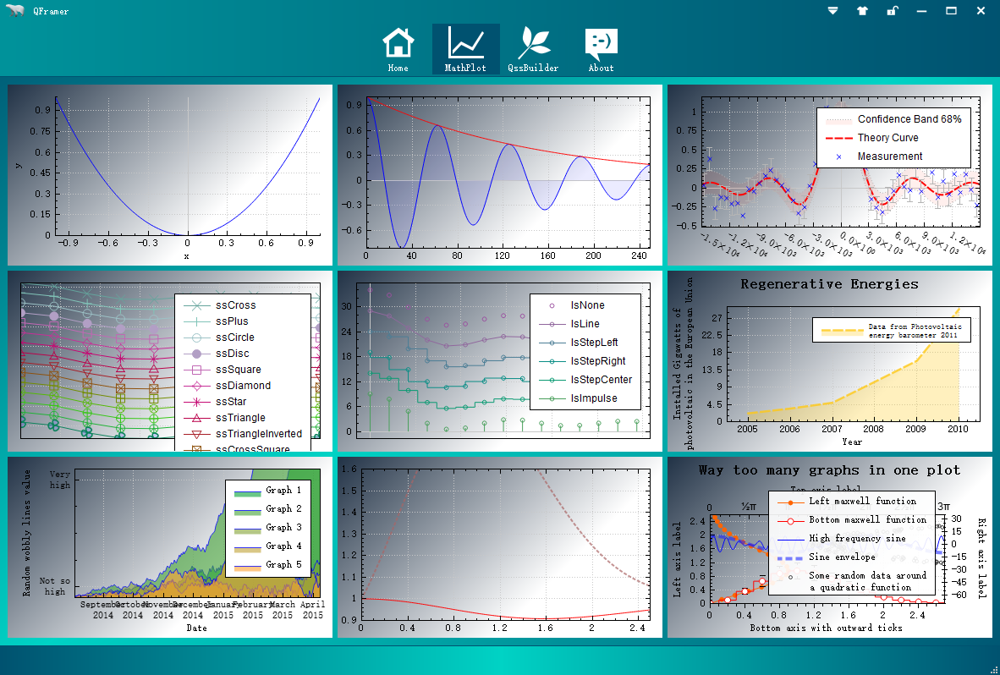
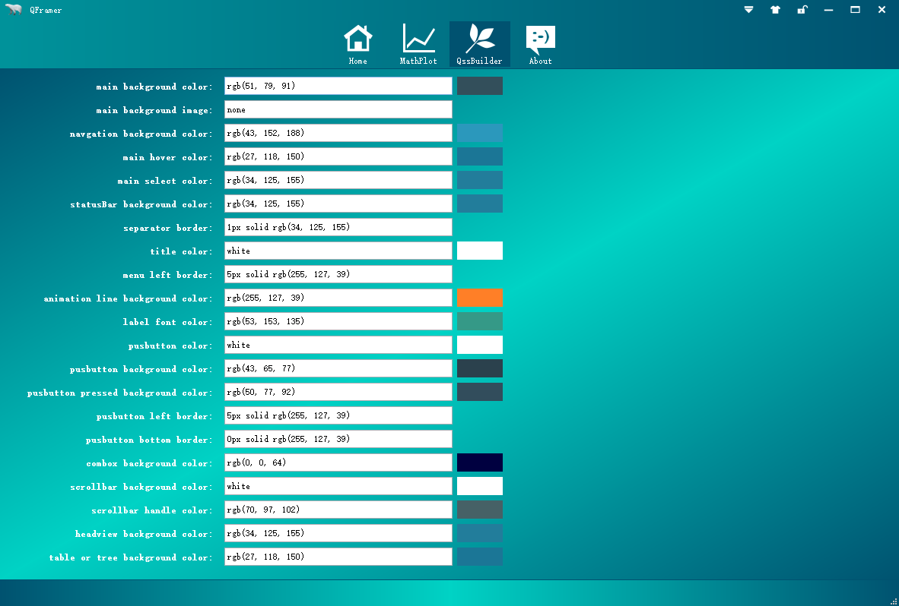
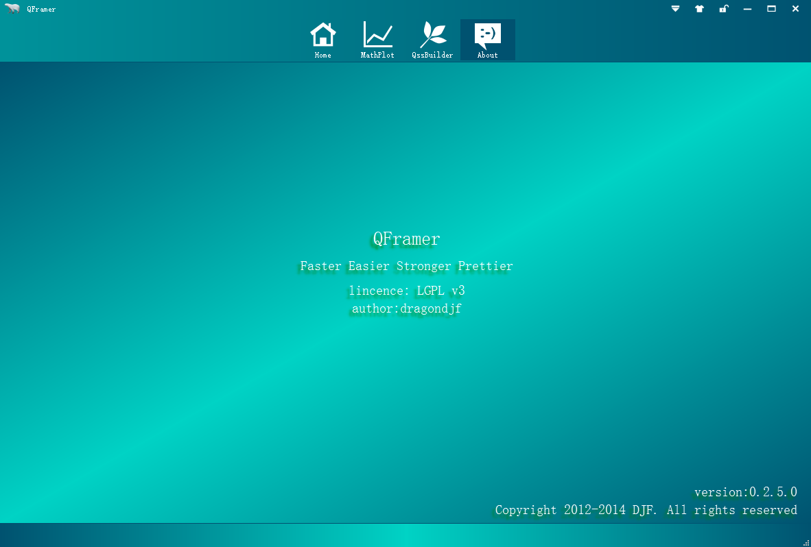

QFramer 
============
+ <a href="http://qt.qframer.com">Why QFramer?</a>  
+ <a href="http://dragondjf.github.io/qframer/Qt--QFramer.html">How to use QFramer?</a>

####1.Introduction
>It's a frame based on Qt5.3, you will be more efficient with it. As an Qter,Qt give us a nice coding experience.With  user interactive experience(UE) become more and more important in modern software, deveployers should consider business and UE.So, QFramer is born. QFramer's goal is to be a mature solution which you only need to be focus on your business but UE for all Qters.

####2. Support Qt version：
    support Qt4.8 and 5.3, 5.4 It works well with Qt4.8.6、Qt5.3.0、Qt5.3.1 and Qt5.4.0.

####3. Feature
+ `custom titleBar`: support logo, title setiings, skin, lock, maximumed, maximumed, close custom definition.
+ `custom navgationBar`:  support add custom navagation tab.
+ `custom systemTray`: support add custom SystemTray and add context menu to SystemTray
+ `custom fly window`: support add fly window on desktop and add context menu to fly window
+ `custom leftside bar`: support leftside navagtion for custom widget
+ `custom about page`: support custom define about page
+ `custom skin`: support custom ui skin by qss
+ `......`

####4 Download
+ `source:` https://github.com/dragondjf/QCFramer/archive/develop.zip
+ `Realease`: http://pan.baidu.com/s/1qWI2lXi

####5: Snapshot

####6.Contact
+ `Email:` ding465398889@163.com or dragondjf@gmail.com or 465398889@qq.com
+ `Github:` https://github.com/dragondjf/QCFramer

>  `If this framework is helpful to you , it's my pleasure!`
