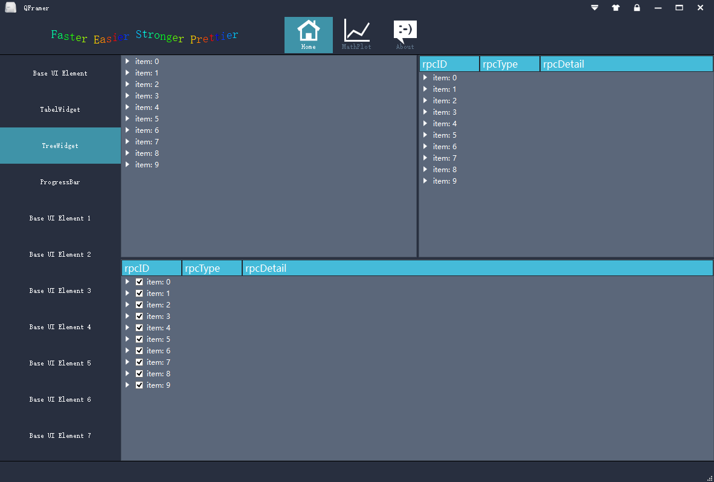
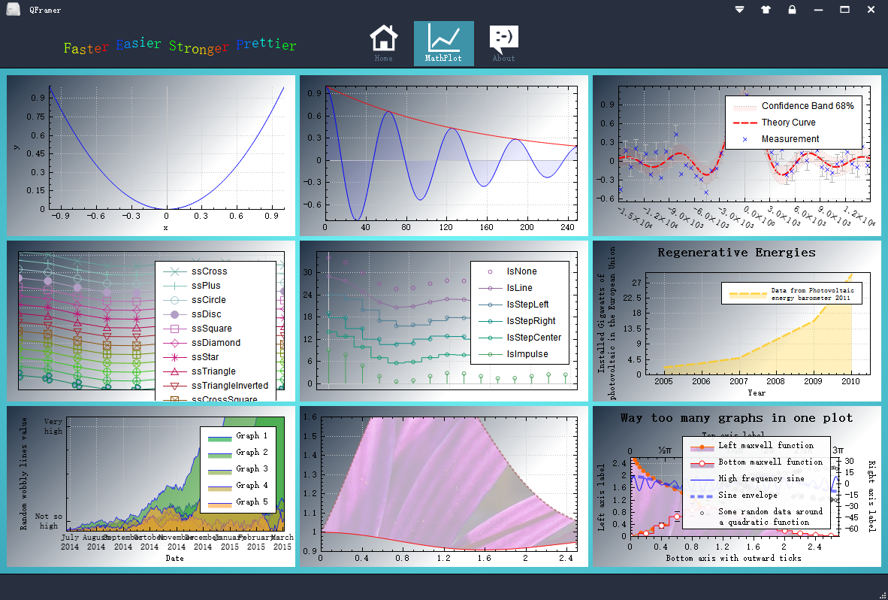
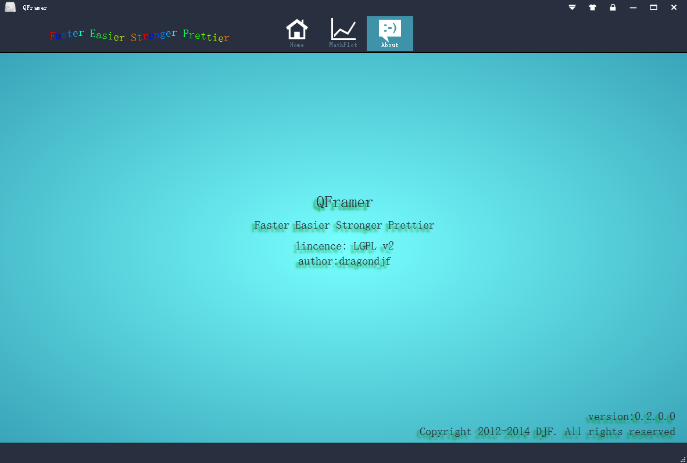

QFramer 
============
####1.Introduction
>It's a frame based on Qt5.3, you will be more efficient with it. As an Qter，Qt give us a nice coding experience.
With  user interactive experience(UE) become more and more important in modern software, deveployers should consider business and UE.So, QFramer is born. QFramer's goal is to be a mature solution which you only need to be focus on your business but UE for all Qters.

####2. Feature
+ `custom titleBar`: support logo, title setiings, skin, lock, maximumed, maximumed, close custom definition.
+ `custom navgationBar`:  support add custom navagation tab.
+ `custom SystemTray`: support add custom SystemTray and add context menu to SystemTray
+ `custom fly window`: support add fly window on desktop and add context menu to fly window
+ `custom lefeside bar`: support leftside navagtion for custom widget
+ `custom about page`: support custom define about page
+ `custom skin`: support custom ui skin by qss
+ `......`

####3 Download
+ `source:` https://github.com/dragondjf/QCFramer    
+ `Realease`: http://pan.baidu.com/s/1qWI2lXi

####4: Snapshot

####5.Contact
+ `Email:` ding465398889@163.com or dragondjf@gmail.com or 465398889@qq.com
+ `Github:` https://github.com/dragondjf/QCFramer

>  `If this framework id helpful to you , please add a star `
