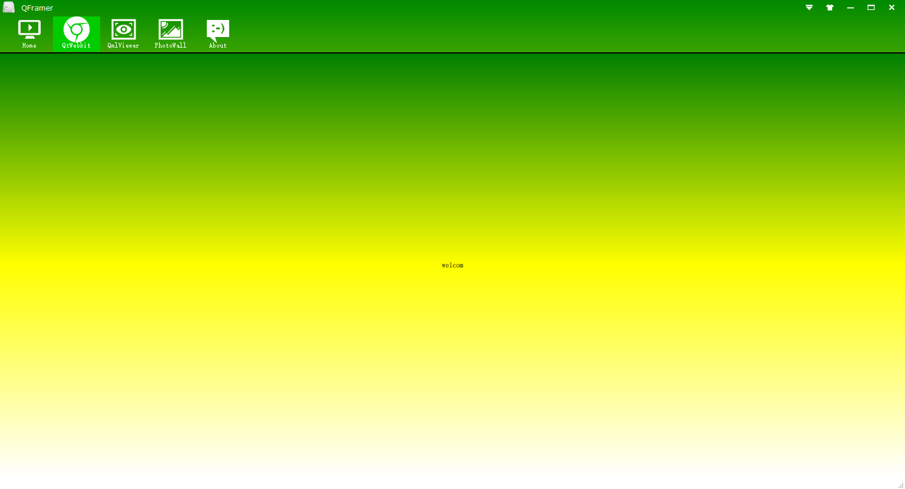
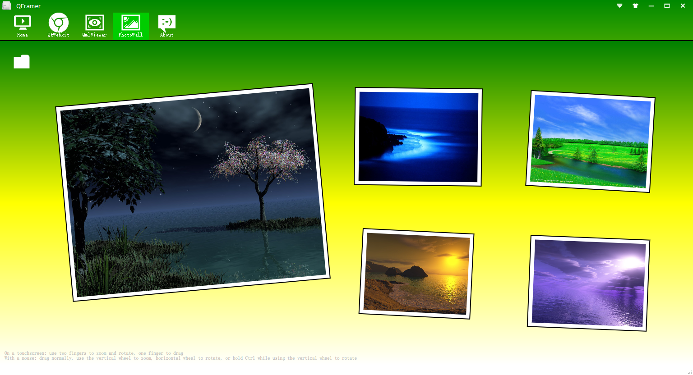
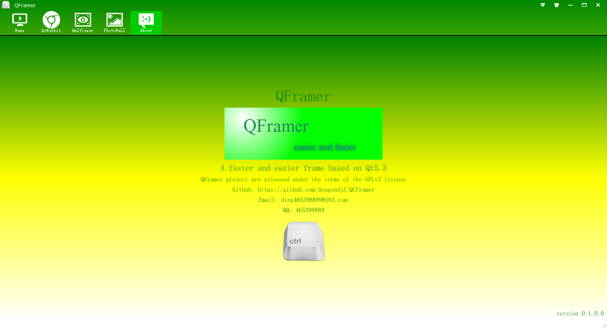

基于Qt5的快速开发框架QFramer
===========================================================
1.概述

    QFramer采用qtwidgets + qml进行混合开发，致力于成为一种高效优美的开发范式，开发者可以将更多的经历放在业务逻辑上，提供生产效率。

2.预览

3.联系我：

    Github: https://github.com/dragondjf/QCFramer
    Email: ding465398889@163.com
